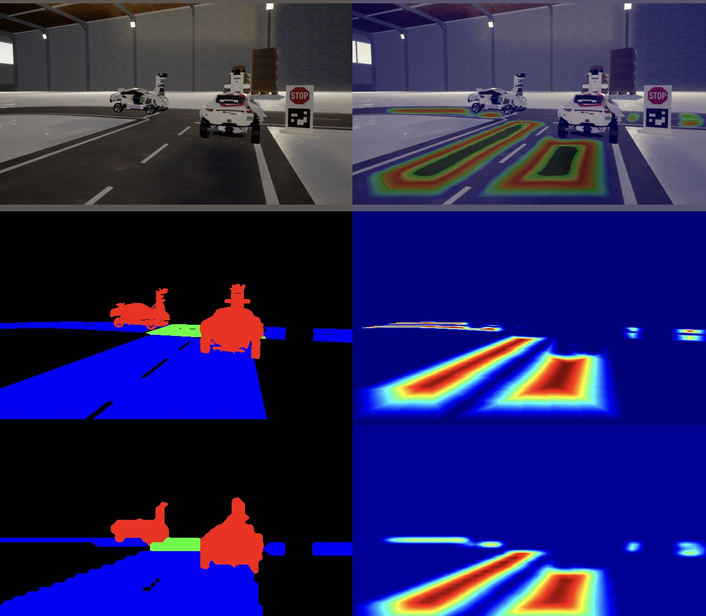

# FreiCAR - An Autonomous Driving Project

- **Vehicle Control:** The project implements PID and pure pursuit controllers for vehicle control. 

- **Perception:** Focuses on solving semantic segmentation and lane regression tasks for improved perception.

- **Localization:** Utilizes a particle filter for localization within the FreiCAR environment.
